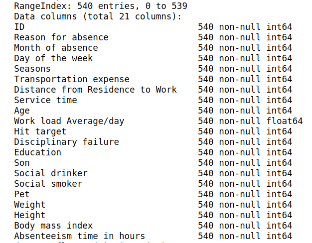
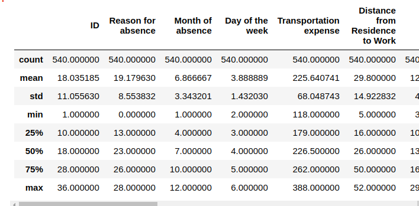
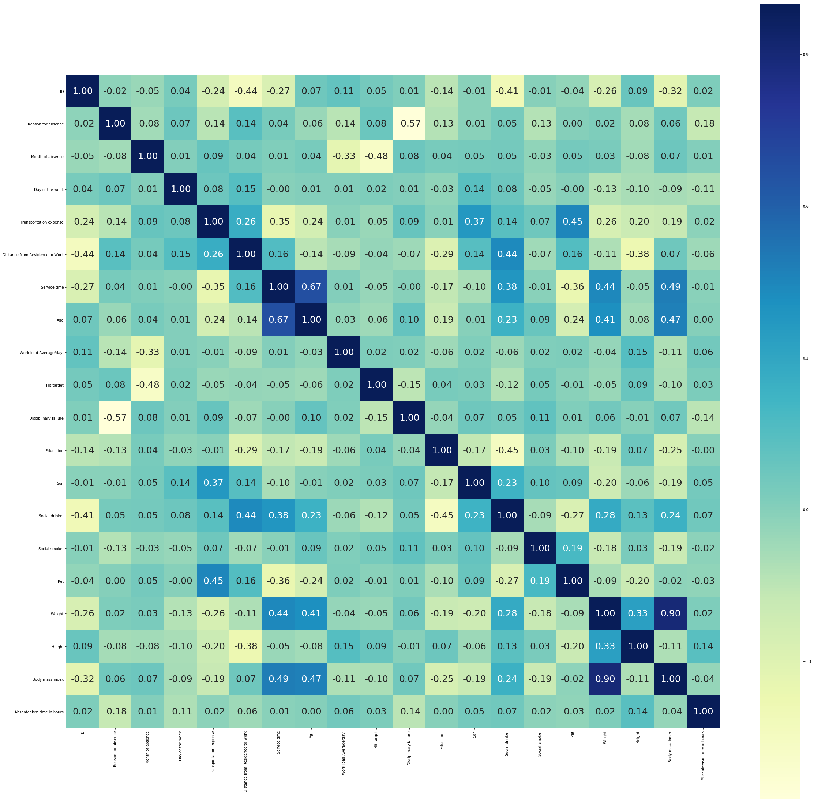
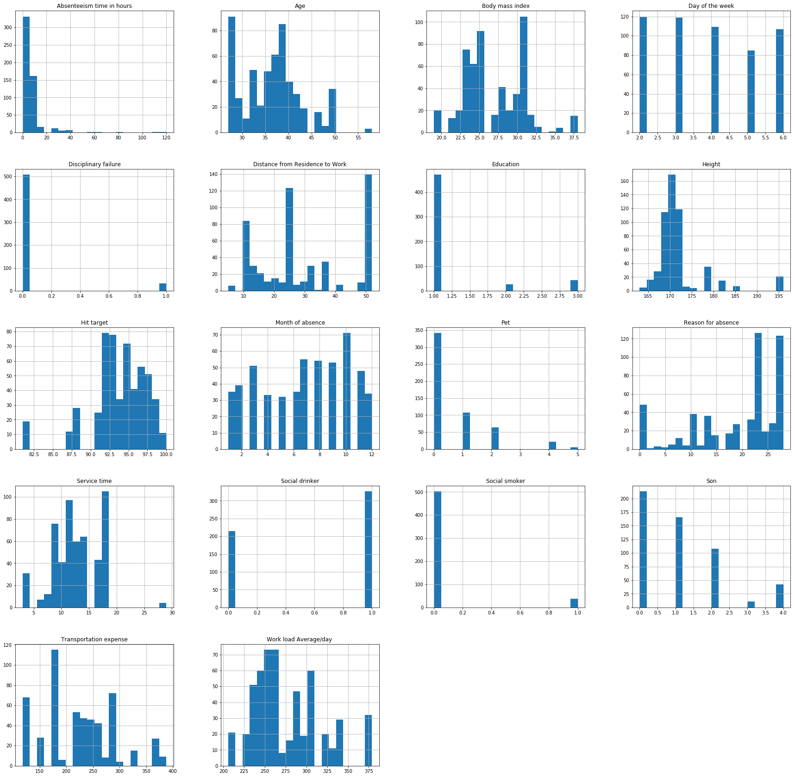
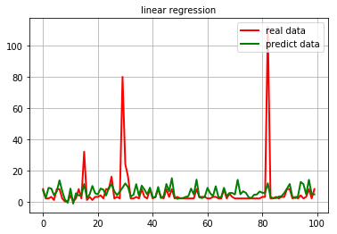
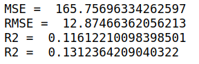
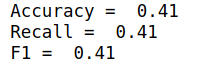

<h1 style="text-align:center;font-size:250%"><b>
Intelligent Data Analysis Assignment 1
</b></h1>

<h2 style="font-size:150%"><b>
Tasks
</b></h2>

<p style="text-indent:4mm;margin:0">
There are two main tasks in there assignment:
</p>

<p style="text-indent:4mm;margin:0">
(1) Use <b>“Reason for absence”</b> as the label, adopt a machine learning model to predict the label for a given instance.
</p>

<p style="text-indent:4mm;margin:0">
(2) Use <b>“Absenteeism time in hours”</b> as the target, adopt a machine learning model to predict the target of a given instance.
</p>

<p style="text-indent:4mm;margin:0">
So there are two main tasks, regression and classification. The assignment contains 3 main steps: analysis the data, pre-process the data and classification/regression.
</p>

<p style="text-indent:4mm;margin:0">
The next three parts will be each step of this assignment.
</p>

<h2 style="font-size:150%"><b>
Analysis the data
</b></h2>

<h3 style="text-indent:2mm;margin:0"><b>
(1) Reading data
</b></h3>

<p style="text-indent:4mm;margin:0">
The first step is reading data from data files. Here I use api from <b>pandas</b> library, as it show below:
</p>

```python
train_path = "train.csv"
test_path = "val.csv"
```

<p style="text-indent:4mm;margin:0">
After reading, the raw is gotten. Using api from pandas library to get more details of the data. Information is like: data types, total numbers, if existing null data, total space and so on.
</p>

<p style="text-align:center;margin:1">

</p>
<p style="text-align:center;margin:0">
Figure 1: Data information
</p>

<h3 style="text-indent:2mm;margin:0"><b>
(2) Analyzing
</b></h3>

<p style="text-indent:4mm;margin:0">
Combining with the data file, It can be determined that some data belongs to a continuous type, some data belong to a discrete type, and the rests are boolean type. The different types of data determine how the data is processed later, data with a discrete type may be transformed with the method one-hot encoding for instance.
</p>

<p style="text-indent:4mm;margin:0">
At the same time, with the help of orignial data file, we could have a rough understanding of the data. Using funciton decribe() we can get the <b>statistical characteristics of the data</b>, like mean/average, and then make more analysis.
</p>

<p style="text-align:center;margin:1">

</p>
<p style="text-align:center;margin:0">
Figure 2: Data statistical information
</p>

<p style="text-indent:4mm;margin:0">
For example, as we can see, "ID" is not primary, that means some students have been absence more than one time, so "ID" may effect the regression or classification. "Disciplinary failure", "Social drinker", "Social smoker" is the data with boolean type, so the minimal is 0 while the maximal is 1.0. 20%/50%/75% tells us a rough distribution of data, with other methods like drawing scatter plot could help us understand the distribution of data more intuitively.
</p>

<p style="text-indent:4mm;margin:0">
Using api to calculate the correlation coefficient of each pair of data, and draw heatmap matrix, as follows:
</p>

<p style="text-align:center;margin:1">

</p>
<p style="text-align:center;margin:0">
Figure 3: Correlation matrix
</p>

<p style="text-indent:4mm;margin:0">
It’s obviously illustrated that: There is strong positive correlation between "Weight" and "Body mass index". So here using one of them is enough. Also, "Age" and "Service time" are similar. Using correlation coefficient also helps us find the relation between target label and other attributes.
</p>

<p style="text-align:center;margin:1">

</p>
<p style="text-align:center;margin:0">
Figure 4: Histogram
</p>

<p style="text-indent:4mm;margin:0">
A normal distribution is an arrangement of a data set in which most values cluster in the middle of the range and the rest taper off symmetrically toward either extreme, which is the best distribution for the machine learning methods. Using data distribution histogram to check if data is biased or "skewed".
</p>

<p style="text-indent:4mm;margin:0">
And we could find attributes "Age", "Absenteeism time in hours", "Height", "Hit target", "Reason for absence" are more or less bias.
It is necessary to solve the bias of these attributes.
</p>

<p style="text-indent:4mm;margin:0">
Moreover, some data are quite different from other data. Such data may be the noise while sampling, they may effect the training result. So they should also be processed.
</p>

<p style="text-indent:4mm;margin:0">
Moreover, some data are quite different from other data. Such data may be the noise while sampling, they may effect the training result. So they should also be processed.
</p>

<p style="text-indent:4mm;margin:0">
After analyzing, the coming step is pre-processing.
</p>

<h2 style="font-size:150%"><b>
Pre-processing
</b></h2>

<p style="text-indent:4mm;margin:0">
In previous steps, data with different types have been splited, here some methods will be used to deal with each type of data.
</p>

<h3 style="text-indent:2mm;margin:0"><b>
(1) Biased data
</b></h3>

<p style="text-indent:4mm;margin:0">
I deal with biased data first. Using log function to transform distributions. However, checking if the data is "skewed" enough before transforming.
</p>

```python
for s in featureCon:
    if(abs(train_raw_data[s].skew()) > skew_line):
        train_raw_data[s] = train_raw_data[s].apply(lambda x : np.log(x + 1))
        test_raw_data[s] = test_raw_data[s].apply(lambda x : np.log(x + 1))
```

<h3 style="text-indent:2mm;margin:0"><b>
(2) Abnormal data
</b></h3>

<p style="text-indent:4mm;margin:0">
In these assignment, I calculate quartile(四分位数) for each attributes, Q1 splits off the lowest 25% of data from the highest 75%, Q2 is the median, Q3 splits off the highest 25% of data from the lowest 75%. Defining IQR as the distance between Q1 and Q3, setting the upper bound Q3 + a * IQR and the lower bound Q4 - a * IQR, a is the parameter. For attributes, delete those data which Outside the upper and lower bounds. The code is as follows:
</p>

```python
index = set(train_raw_data.index)
for s in featureAbn:
    percentile = np.percentile(train_raw_data[s], [0, 25, 50, 75, 100])
    IQR = percentile[3] - percentile[1]
    upLimit = percentile[3]+IQR*IQR_limit
    downLimit = percentile[1]-IQR*IQR_limit
    for idx in index:
        if(train_raw_data.loc[idx][s] > upLimit or train_raw_data.loc[idx][s] < downLimit):
            train_raw_data.drop([idx], inplace=True)
            index = index - set([idx])
```

<h3 style="text-indent:2mm;margin:0"><b>
(3) Decide which attribute to use
</b></h3>

<p style="text-indent:4mm;margin:0">
Calculating correlation coefficient again and selecting those attributes that are sufficiently large for the coefficient value associated with the target attribute. However, scikit-learn alse provides apis to achieve such job, like <b>GenericUnivariateSelect</b> to select attributes conveniently. Here is the code of attribute selecting:
</p>

```python
using_attrs = []
for attr in rest_attrs:
    if(abs(corr_matrix["Absenteeism time in hours"][attr]) > corr_line):
        using_attrs.append(attr)
```

<h3 style="text-indent:2mm;margin:0"><b>
(4) Standardization and Spliting
</b></h3>

<p style="text-indent:4mm;margin:0">
The last step of data pre-processing. For continues data, using StandardScaler to standardize. For discrete data, using one-hot encoding.
</p>

```python
if(X_vec_con.shape[1] > 0):
    scaler=preprocessing.StandardScaler().fit(X_vec_con)
    X_vec_con_ed=scaler.transform(X_vec_con)
else:
    X_vec_con_ed = X_vec_con
if(X_vec_cat.shape[1] > 0):
    enc=preprocessing.OneHotEncoder(categories='auto')
    enc.fit(X_vec_cat)
    X_vec_cat_ed=enc.transform(X_vec_cat).toarray()
else:
    X_vec_cat_ed = X_vec_cat
```

<p style="text-indent:4mm;margin:0">
Combine each part of data, then splite them into training set and testing set.
</p>

```python
x_train = X_vec[0 : n_train]
y_train = Y_vec[0 : n_train]
x_test = X_vec[n_train : n_test+n_train]
y_test = Y_vec[n_train : n_test+n_train]
```

<h2 style="font-size:150%"><b>
Meachine Learning Models
</b></h2>

<p style="text-indent:4mm;margin:0">
As for model, cause calculating the linear correlation before, here I choose linear <b>regression</b> and <b>SVR</b> for regression and SVC for classification. Linear regression is easy to achieve but may not suitable to complicate situation, SVR or SVC is more flexible cause they could use different kernel. However here I just use the linear kernel. With the help of sklearn, it's convenient to achieve machine learning methods.
</p>

```python
from sklearn.linear_model import LinearRegression
from sklearn.metrics import mean_squared_error
linreg = LinearRegression().fit(x_train, y_train)
y_pre = linreg.predict(x_test)
mse = mean_squared_error(y_test, y_pre)
rmse = np.sqrt(mse)
```

```python
from sklearn.linear_model import LinearRegression
from sklearn.metrics import mean_squared_error
linreg = LinearRegression().fit(x_train, y_train)
y_pre = linreg.predict(x_test)
mse = mean_squared_error(y_test, y_pre)
rmse = np.sqrt(mse)
```

<p style="text-align:center;margin:1">

</p>
<p style="text-align:center;margin:0">
Figure 5: Regression
</p>

<h2 style="font-size:150%"><b>
Results
</b></h2>

<p style="text-indent:4mm;margin:0">
Maybe linear model is not fit to such data set. The mes and the accuracy of classification is not well enough.
</p>

<p style="text-align:center;margin:1">

</p>
<p style="text-align:center;margin:0">
Figure 6: Result of regression
</p>

<p style="text-align:center;margin:1">

</p>
<p style="text-align:center;margin:0">
Figure 7: Result of classification
</p>

<p>
<b>Note: </b>For some reason I am not use Anaconda to manage python packages, just using pip.
</p>

<p>
How to use:
</p>

```python
python exp.py train_path test_path
```