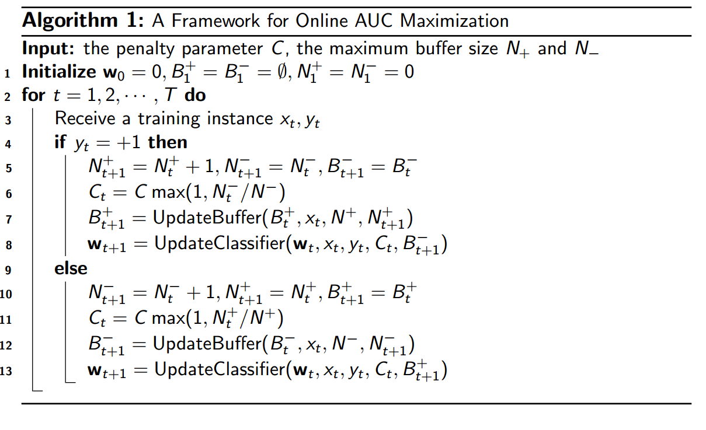
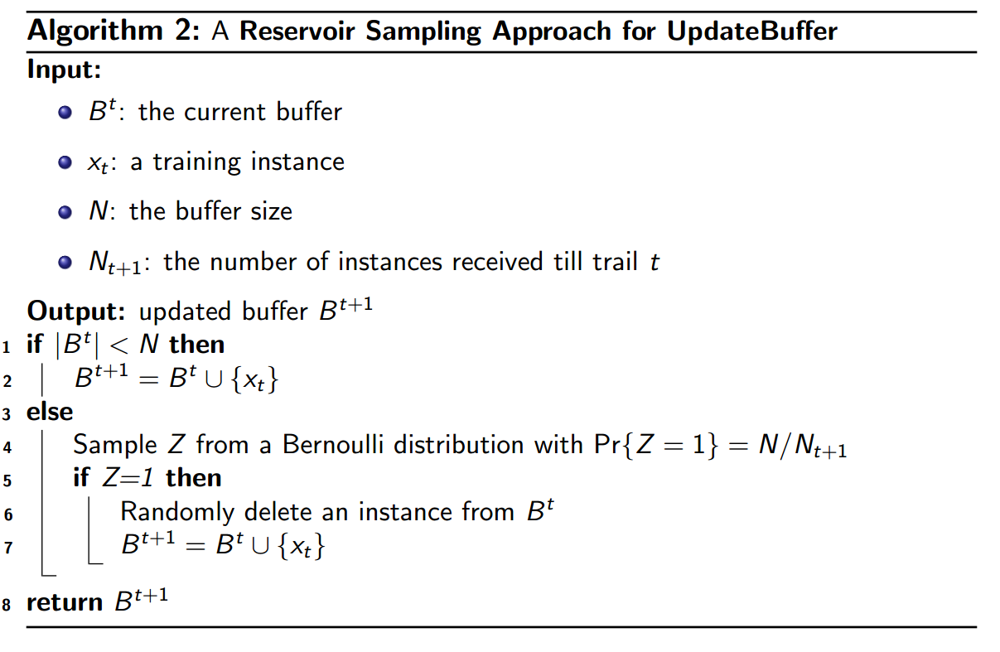
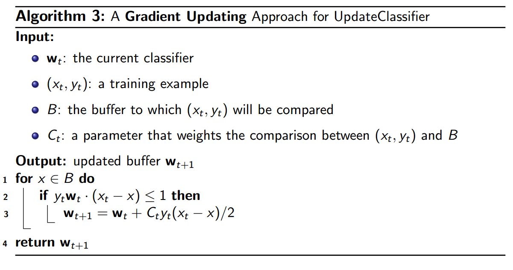
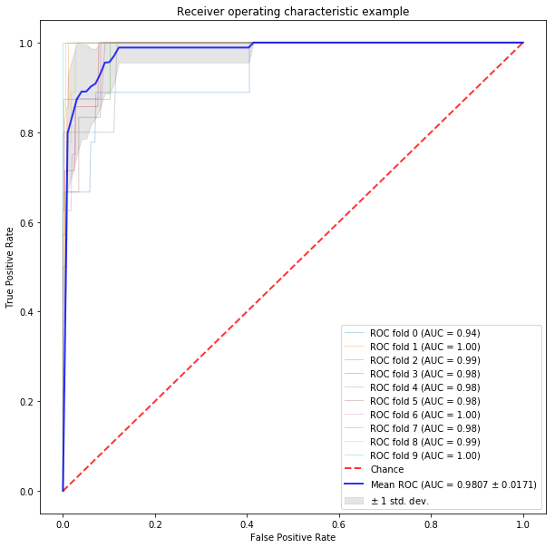
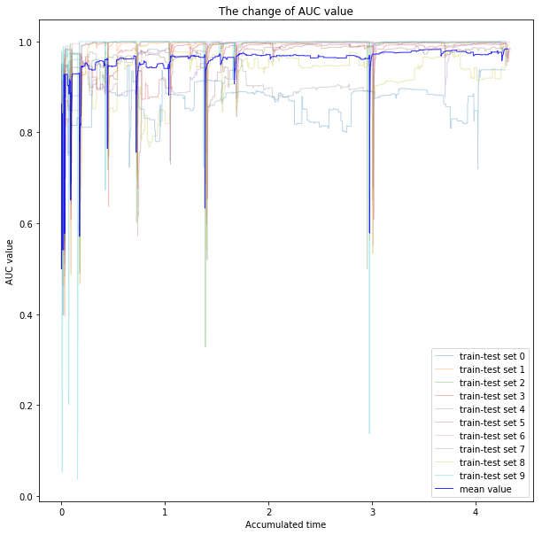
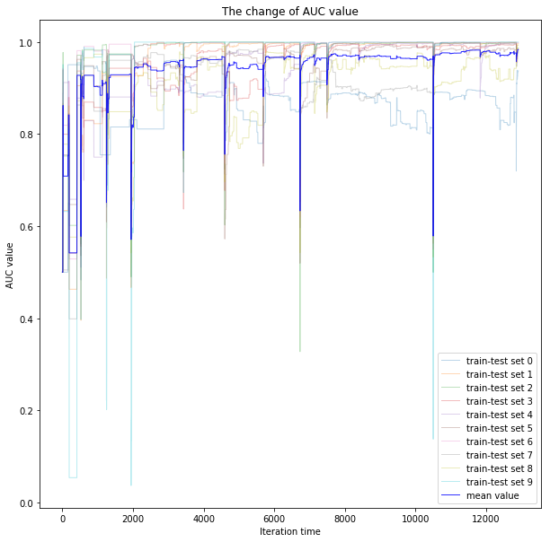

# Intelligent Data Analysis Assignment 2
  
  
## Brief Introduction
  
  
- Purpose:
  - Develop an **online AUC maximization** for highly imbalanced binary classification problem
  - Running with time limits: **10 seconds**.
  - The assignment contains 3 steps:
    1. Pre-process the data
    2. Develop the algorithm
    3. Apply the algorithm to the dataset.
- Pre-process:
  - Load data "train.mat", using **scipy.io.loadmat**.
  - Data preprocessing with **sklearn.Preprocessing**.
  - Report AUC of the model on test dataset. The AUC score of a model can be calculated by **metrics.roc_curve** and **metrics.auc** provided by sklearn.
  - Using cross-validation on training data.
- Requirement
  - The code should accept the path of the data file as input
  
    ```shell
    > python exp.py ./train.mat
    ```
  
  - Output the AUC score of the output model on the testing data
  
    ```shell
    > AUC Score: 0.98
    ```
  
- The provided package should contain: report + source code
  - Report:
    - How you pre-process the data.
    - The details of implementing the algorithm.
    - The results.
    - Free to use English or Chinese.
    - Only allow the standard package contained in Anaconda 3.
  
## Data Preprocessing
  
  
- Usually, data preprocessing has several steps.
- Loading data:
  - Loading data from files, data format needs to be considered, as different formats need us to set corresponding parameters or use corresponding data loading APIs. In order to process massive data quickly, one may replace data types with formats that consume less storge space, ex. using int8 to replace int64.
- Dealing with null data:
  - Checking if some data is NULL of invalid using some methods, ex. average value, to replace invalid data.
- Feature selection:
  - People need to decide which features are helpful to models and which are not, sometimes one should make some new features from existing feature. Checking correlation may be helpful to delete extra features.
- Data processing:
  - Checking if data is skewed.
  - For continues data: data standardization, normalization or other methods.
  - For discrete data: one-hot encoder or other methods.
- Data split:
  - Spliting data into training and test sets.
  
### Loading data
  
  
- For this assignment, the training data is in **.mat** format, using **scipy.io.loadmat** to read. Matlab data format contains 'x_tr' and 'y_tr' as key value, we can get x-data and y-data corresponding keyword in the dictionary.
  
```python
from scipy.io import loadmat
raw_data = loadmat("data/train.mat")
raw_x = raw_data['x_tr']
raw_y = raw_data['y_tr']
n_total = len(raw_x)
```
  
### Data processing
  
  
- Fortunately, thee is no invalid data in the training data, and all data is discrete data, which values are 0 or 1. So there I only use MinMaxScaler to normalize the data (however may be it makes no difference).
  
```python
from sklearn.preprocessing import MinMaxScaler
scaler = MinMaxScaler()
scaler.fit(raw_x)
scaler.transform(raw_x)
```
  
### Data split
  
  
- In this assignment, I use **10-fold cross validation** method for data training. This method needs to split data into 10 disjoint subsets uniformly, for each subset, using one as test set while others are training set to check the model's effectiveness. In other word, we need to process data training 10 times.
- Using **train_test_split** from sklearn to split data into 10 subsets.
- Before spliting, I **add bias** for x data.
  
```python
bia = np.ones((len(raw_y), 1))
raw_x_bias = np.hstack((raw_x, bia)) # add bias
from sklearn.model_selection import train_test_split
x_data = []
y_data = []
x_, y_ = raw_x_bias, raw_y
for fold in range(9, 0, -1):
  x_, x_split, y_, y_split = train_test_split(x_, y_, test_size=(1.0 / (fold + 1)))
  x_data.append(x_split)
  y_data.append(y_split)
x_data.append(x_)
y_data.append(y_)
```
  
## Online AUC Maximization Algorithm
  
  
- The assignment's data is of highly imbalanced for there exists much more negative labels than positive ones.
- The AUC (Area under ROC curve) is a performance measure in the setting of class-imbalanced data. It quantifies the ability of correctly ranking any positive instance with regards to a randomly chosen negative instance.
  
<p align="center"></p>  
  
  
- It's often use to compare classifiers, as the bigger AUC means better classifiers.
- Class-imbalanced data tackled by directly optimizing AUC
- In this assignment we consider AUC maximization in the online learning setting
  - Able to tackle the case with streaming data
  - Scalable as it updates model based on a single example
- Using algorithm according to paper (Zhao et al., 2011) and lecture's ppt.
- Consider the problem with the hinge loss:
  
<p align="center"></p>  
  
  
- C is a positive penalty parameter.
- Rewrite (1) into a sum of losses for individual instances
  
<p align="center"></p>  
  
  
-  is defined as
  
<p align="center"></p>  
  
<p align="center"></p>  
  
<p align="center"></p>  
  
  
- Eq.(2) requires to store the previous training examples
- Need to consider the latest example with previous example
- O(td) time complexity and space complexity per iteration
- Caching a small number of received training examples:
  - Buffer  : storing the received positive instances
  - Buffer  : storing the received negative instances
- Here are the algorithm processes and codes:
  
<p style="text-align:center;margin:0">

</p>
<p style="text-align:center;margin:1">
Online AUC Maximization
</p>
  
```python
def onlineAucMaximum(x, y, n_pos, n_neg, C = 1.0):
  w = np.zeros((x.shape[1], 1))
  n_pos_t = 0
  n_neg_t = 0
  b_pos = []
  b_neg = []
  for idx in range(len(y)):
    if(y[idx] == 1):
      n_pos_t += 1
      C_t = C * max(1, n_neg_t / n_neg)
      b_pos = updateBuffer(b_pos, x[idx], n_pos, n_pos_t)
      w = updateClassifier(w, x[idx], y[idx], C_t, b_neg)
    else:
      n_neg_t += 1
      C_t = C * max(1, n_pos_t / n_pos)
      b_neg = updateBuffer(b_neg, x[idx], n_neg, n_neg_t)
      w = updateClassifier(w, x[idx], y[idx], C_t, b_pos)
  return w
```
  
<p style="text-align:center;margin:0">

</p>
<p style="text-align:center;margin:1">
UpdateBuffer
</p>
  
```python
def updateBuffer(buff, x, n_buff, n_buff_t):
  if(len(buff) < n_buff):
    buff.append(x)
  else:
    z = np.random.random()
    if(z < float(n_buff / n_buff_t)):
      idx = np.random.randint(0, len(buff))
      buff[idx] = x
  return buff
```
  
<p style="text-align:center;margin:0">

</p>
<p style="text-align:center;margin:1">
UpdateClassifier
</p>
  
```python
def updateClassifier(w, x, y, C, buff):
  for sample in buff:
    if(y * np.dot(w.T, (x - sample)) <= 1):
      grad = C * y * (x - sample) / 2
      grad = grad[:, np.newaxis]
      w = w + grad
  return w
```
  
- The hyperparameter I adjust is the max buffer size of positive and negative buffer and penalty parameter C.
- As mentioned in the previous section, using 10-fold cross validation, there are ten groups of training and testing set be trained. So, before running the AUC maximization kernel, combining datasets is necessary.
  
```python
for fold in range(10):
  tmp = range(fold) + range(fold+1,10)
  x_test = x_data[fold]
  y_test = y_data[fold]
  x_train = x_data[tmp[0]]
  y_train = y_data[tmp[0]]
  for idx in range(1, 9):
    x_train = np.concatenate((x_train, x_data[idx]))
    y_train = np.concatenate((y_train, y_data[idx]))
  # train
  res = onlineAucMaximum(args)
```
  
## Result and Analysis
  
  
- Calculating each groups AUC and w (parameters for linear model), calculating average AUC and w as the result of training.
- I collect each training group's auc value and accumulated training time at each iteration. As for auc value, I calculate the average value and variance of ten groups.
  
<p style="text-align:center;margin:0">

</p>
<p style="text-align:center;margin:1">
ROC curve for each group and average ROC
</p>
  
- As it shown in the figure's label, the average AUC value at this traing episode is 0.9807 while the variance is 0.017.
- From the figure we can se that some groups' AUC value is optimized sufficiently as their AUC is close to 1 however there exists groups with AUC value is much lower.
  
<p style="text-align:center;margin:0">

</p>
<p style="text-align:center;margin:1">
AUC value with training time
</p>
  
<p style="text-align:center;margin:0">

</p>
<p style="text-align:center;margin:1">
AUC value with iteration time
</p>
  
- As it shown in the figures, the average training time in my process is close to 4s, and the AUC value is increasing generally. For some steps, the AUC value gets lower and shock variently, especially at the beginning of training. Some groups optimize not well at last, may it's partly caused by randomly data split.
  
```python
print(mean_auc)
print(std_auc)
0.9807
0.0172
```
  
- At last, using average AUC value as the output.
- The avarage linear parameter w will be used for test dataset.
  
## Reference
  
  
1. W. Gao, R. Jin, S. Zhu, and Z.-H. Zhou. One-pass auc optimization. In International Conference on Machine Learning, pages 906-914, 2013.
2. M. Liu, X. Zhang, Z. Chen, X. Wang, and T. Yang. Fast stochastic auc maximization with o (1/n)-convergence rate. In International Conference on Machine Learning, pages 3195-3203, 2018.
3. M. Natole, Y. Ying, and S. Lyu. Stochastic proximal algorithms for auc maximization. In International Conference on Machine Learning, pages 3707-3716, 2018.
4. Y. Ying, L. Wen, and S. Lyu. Stochastic online auc maximization. In Advances in neural information processing systems, pages 451-459, 2016.
5. P. Zhao, S. C. Hoi, R. Jin, and T. YANG. Online auc maximization. 2011.
  