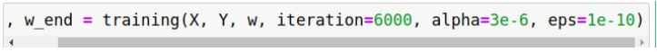

# 统计机器学习回归任务

请考虑以下 2 种不同 feature 的模型，回答第 (1) ~ (3) 題：

1. 抽全部 9 小时内的污染源 feature 当作一次项(加 bias)9x18+1=163 种 feature（9 小时内所有 18 种测量值+bias项）

2. 抽全部 9 小时内 pm2.5 的一次项当作 feature(加 bias) 9x1+1=10 种 feature（9 小时内所有 PM2.5 值+bias 项）

### 备注：

a. NR 請皆設為 0，其他的數值不要做任何更動

b. 所有 advanced 的 gradient descent 技術(如: adam, adagrad 等) 都是可以用的

c. 第 1-3 題請都以題目給訂的兩種 model 來回答

### 任务：

## 1. (2%)記錄誤差值 (RMSE)(根據 public+private 分數)，討論兩種 feature 的影響

- 本数据集的数据属性和带预测数据具有比较大的线性相关性。在做本一问时，暂时未使用偏置项，使用的是最基本的梯度下降方法，学习率固定，参数设置例子如下：

- $\alpha$ 即为学习率，$\epsilon$ 作为迭代退出条件，iteration 是最大迭代次数。一次项系数向量 w 从 0 点出发。w0=\[0,0,0...,0\]
- 在使用全部污染源属性作为一次项的情况下，结果如下：
- 参数：

- RMSE变化曲线：

- 使用测试集进行预测，最终的 RMSE 值：

- (2)在使用单 PM2.5 属性作为一次项的情况下，结果如下：
- 参数：

- RMSE变化曲线：

- 使用测试集进行预测，最终的 RMSE 值：

- 分析：由于线性相关性较强，两种 feature 选择得到的结果差异不大。由训练情况来看，只用 10 种属性作为 feature 效果更好，不过这个主要是因为使用更少的 feature 可以接受更大的学习率，收敛可能更快。更多的 feature 意味着（初始）学习率必须设置更小，不然很容易越过 optimal value。

## 2. (1%)將 feature 從抽前 9 小時改成抽前 5 小時，討論其變化影響

- (1)在使用全部污染源属性作为一次项的情况下，结果如下:
- 参数：

- RMSE 变化曲线：

- 使用测试集进行预测，最终的 RMSE 值：

- (2)在使用单 PM2.5 属性作为一次项的情况下，结果如下：
- 参数：

- RMSE 变化曲线：

- 使用测试集进行预测，最终的 RMSE 值：

- 分析：同上一问一样，使用更少的参数可以接受更大的学习率，收敛更快。与第一题对比，只用 5 个小时的数据进行预测效果稍微好于用 10 个小时，单总体而言差别不大。

## 3. (1%)Regularization on all the weight with λ=0.1、0.01、0.001、0.0001，并作图

- (1)在使用全部污染源属性作为一次项的情况下，结果如下：

- (2)在使用单 PM2.5 属性作为一次项的情况下，结果如下：

- 横坐标使用的是 log10(lambda)，从上图可以看出，使用更多的属性，引入正则项，预测效果变好，而更少的属性预测效果变差，但是从图二的纵坐标尺度可以看出，影响比较小。总体而言引入正则项后预测效果有所增加，可能在一些数据分布更为明显的数据集上效果会更加明显。